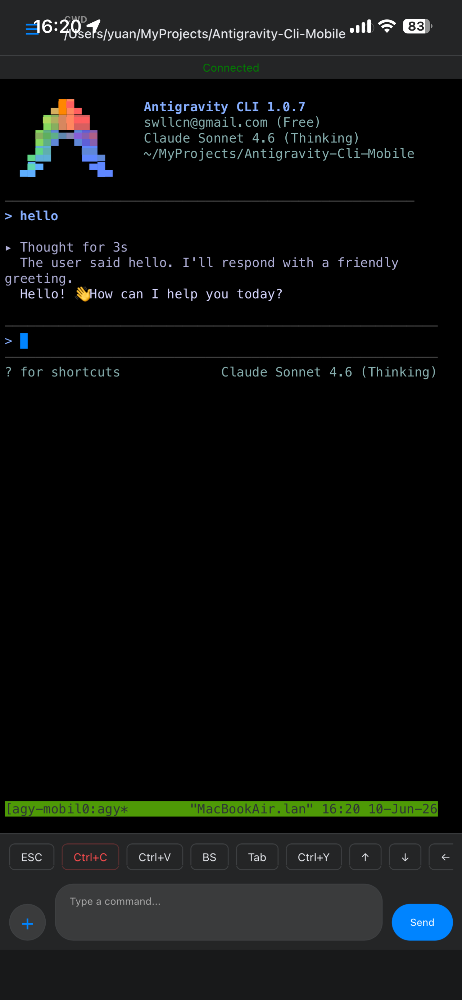

# Agy Mobile 🌉



Agy Mobile is a proxy system that converts local interactive CLI tools (like Antigravity CLI) into a mobile-friendly web chat interface.

It allows you to run CLI tools on a local machine (e.g., behind a NAT) and interact with them from anywhere via a web browser, presented as a chat conversation.

## Features

- **Agent-Relay Architecture**: Securely bridge local CLI tools to the public internet.
- **Persistent Sessions**: Built-in **tmux** integration. Even if you disconnect, your CLI session keeps running.
- **Smart Re-entry**: Restarting the agent automatically attaches to the existing session and preserves chat history on the web.
- **Takeover Logic**: Automatically terminates stale agent processes to prevent duplicate streams.
- **Remote Image Upload**: Upload images via the Web UI (paste or file select). Files are saved to `/tmp/` on the agent machine and automatically synced to the remote clipboard.
- **Advanced Web UI**:
  - **Mobile Optimized**: Enhanced touch-to-scroll simulation for seamless terminal interaction on smartphones.
  - **Multiline Input**: Auto-resizing input box with `Shift+Enter` for newlines.
  - **Quick Shortcuts**: Dedicated buttons for `Ctrl+C`, `Ctrl+V`, `Backspace`, and `Tmux` window management.
  - **Metadata Display**: Real-time display of Current Working Directory (CWD) and Hostname (including IP).
- **Dual Interaction**: Interact with the same session simultaneously from your local terminal and the web interface.
- **ANSI Support**: Preserves terminal colors in the web interface.

## Architecture

- **Agent**: Runs on your local machine. It manages a **tmux** session and connects to the Relay. It supports persistent IDs for seamless reconnections.
- **Relay**: A public-facing server that hosts the Web UI and forwards messages (including binary file data) between the Agent and Web clients.
- **Web UI**: A responsive web interface that displays terminal output and provides a rich set of interaction controls.

## Quick Start

### 1. Installation

**Prerequisite: tmux & Clipboard tools**
Agy Mobile requires `tmux`. For remote clipboard sync (image upload feature), `xclip` or `wl-copy` is recommended on the Agent machine.
```bash
# Ubuntu/Debian
sudo apt-get install tmux xclip

# macOS
brew install tmux
```

**Installation**
```bash
git clone https://github.com/youruser/agy-mobile.git
cd agy-mobile
npm install
npm run build
npm link
```

### 2. Configuration

#### Server Setup (Relay)
On your public server, generate and apply a secure token:
```bash
agy-mobile relay gen-token
```

### 3. Start Relay

On your public server:
```bash
agy-mobile relay start
```

### 4. Start Agent

On your local machine, simply run:
```bash
agy-mobile
```
(Or `npm run start` if not linked)

**First-time run?** The agent will automatically detect missing configuration and guide you through an interactive setup to connect to your Relay.

This process will:
1. **Auto-Configure**: Prompt for Relay URL and Token if missing.
2. **Tmux Integration**: Create or attach to a tmux session named `agy-mobile`.
3. **Session Management**: Automatically handle persistent IDs and take over stale processes.
4. **Cloud Bridge**: Securely stream your session to the Relay.

### 5. Interaction Tips

- **Detaching**: To detach from the session locally without closing it, use `Ctrl+B, D`.
- **Image Upload**: Click the **+** button in the Web UI, paste an image, and click **Upload**. Once you see the success notification, click the blue **Ctrl+V** button to paste the image into tools like Antigravity CLI.
- **Tmux Navigation**: Use the blue **T-New** and **W0-W5** buttons in the Web UI to quickly manage tmux windows.

## Troubleshooting

### macOS: `posix_spawnp failed` when starting

If you see an error like `❌ Failed to spawn process via node-pty` or `Error details: posix_spawnp failed`, it is usually because the `node-pty` helper binary lacks executable permissions on macOS.

Run the following commands to fix it:

```bash
chmod +x node_modules/node-pty/prebuilds/darwin-arm64/spawn-helper
chmod +x node_modules/node-pty/prebuilds/darwin-x64/spawn-helper
```

## License

MIT
